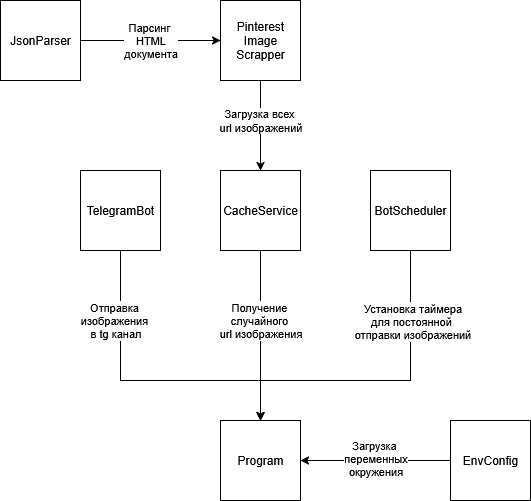

# Pinterest Telegram Bot

Приложение для парсинга Pinterest и отправки изображений в Telegram канал

## Архитектура 



## Запуск бота в виде docker контейнера

Создать файл <code>.env</code> с переменными

| Имя переменной     | Описание                                                                                                                                                                 | Пример                                    |
|--------------------|--------------------------------------------------------------------------------------------------------------------------------------------------------------------------|-------------------------------------------|
| TELEGRAM_BOT_TOKEN | Токен телеграм бота                                                                                                                                                      | 123456:ABC-DEF1234ghIkl-zyx57W2v1u123ew11 |
| CHANNEL_ID         | Id телеграм канала                                                                                                                                                       | @my_channel                               |
| IS_SEARCH          | Флаг включения функции поиска (false - изображения будут парсится с главной старницы Pinterest; true - изображения будут парсится со страницы поиска по ключевому слову) | false                                     |
| PINTEREST_SESSION  | Id сессии Pinterest (залогинится в pinterest, найти cookie под названием <code>_pinterest_sess</code> и скопировать значение)                                            | TWc9PSZudEovNkhaVENCK0NuO...Uo3RHlFPQ==   |


Собрать docker image
```bash
docker build -t pinterest-bot .
```

Заупустить контейнер
```bash
docker run -d --name pinterest-bot --env-file .env pinterest-bot
```